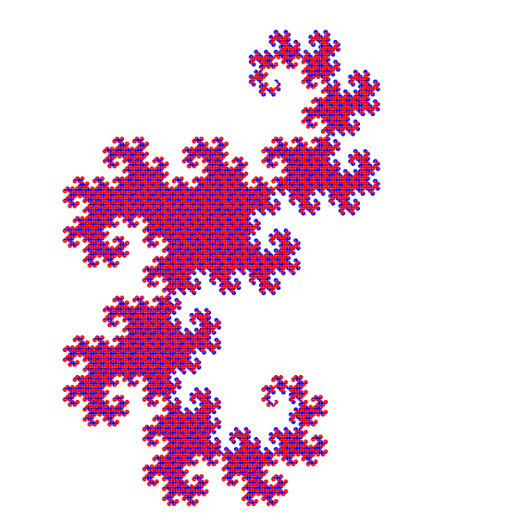

# DragonCurve
«DragonCurve» или «Кривая Дракона» — фрактал похожий на крылья дракона.

Версия: 1.0.0 (06.10.2023)

## Скриншоты

## Интерфейс
Рычажок «Скорость» управляет количеством итераций за кадр.

Кнопка «Скачать» скачивает изображение холста.

Чтобы изменить позицию камеры, нажмите на холст в нужном месте.

## Изменения
### 1.0.0 (06.10.2023)
Первая версия.