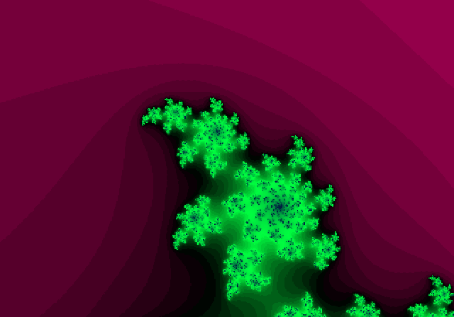
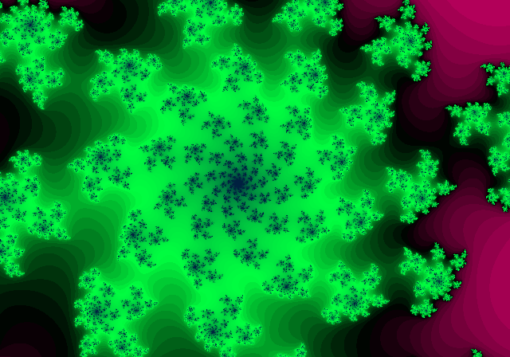

# Julia
«Julia» или «Множество Жюлиа» — фрактал.

Версия: 1.0.0 (13.10.2023)

## Скриншоты

## Интерфейс
Строка «Приближение» показывает текущее приближение к фракталу.

Кнопка «Сброс» сбрасываео приближение.

Кнопка «Скачать» скачивает изображение холста.

Кнопка «+» увиличивает приближение.

Кнопка «-» уменьшает приближение.

Если чекбокс «GPU» отмечен, то фрактал вычисляется на видеокарте, пустой — на процессоре. Вычисления на видеокарте быстрее и картинка имеет большее разрешение. Но максимальное приближение на видеокарте — только 100K (1e5), а на процессоре — 100T (1e14).

Кнопка «Запуск/Пауза» запускает или останавливает приближение. При вычислениях на процессоре её нет.

Чтобы изменить позицию камеры, нажмите на холст в нужном месте. Также, при вычислениях на процессоре, увиличится приближение.

При вычислениях на процессоре чекбокс «double» указывает точность вычислений. Если он отмечен, максимальное приближение увеличивается от 100T (1e14) до 1N (1e30). Но при этом вычисления замедляются и разрешение картинки уменьшаются.

## Изменения
### 1.0.0 (13.10.2023)
Первая версия.