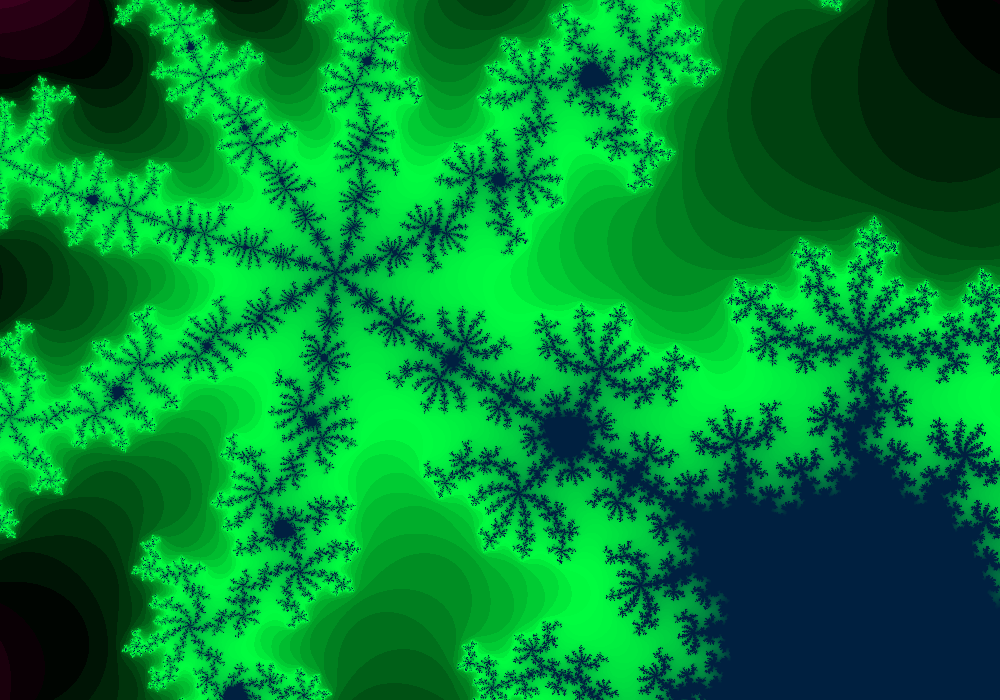
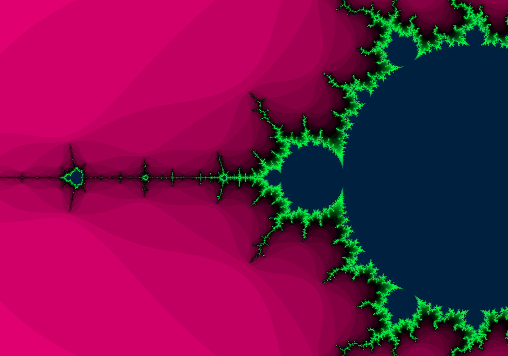

# Mandelbrot
«Mandelbrot» или «Множество Мандельброта» — один из самых известных фракталов.

Версия: 1.0.0 (06.10.2023)

## Скриншоты

## Интерфейс
Строка «Приближение» показывает текущее приближение к фракталу.

Кнопка «Сброс» сбрасываео приближение.

Кнопка «Скачать» скачивает изображение холста.

Кнопка «Запуск/Пауза» запускает или останавливает приближение.

Кнопка «+» увиличивает приближение.

Кнопка «-» уменьшает приближение.

Чтобы изменить позицию камеры, нажмите на холст в нужном месте.