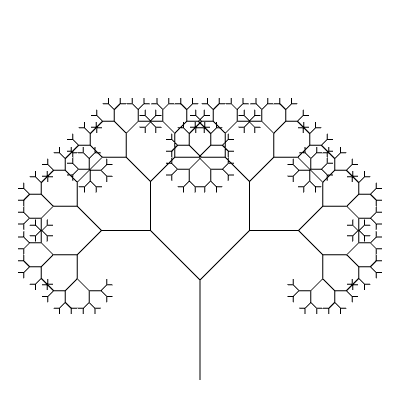
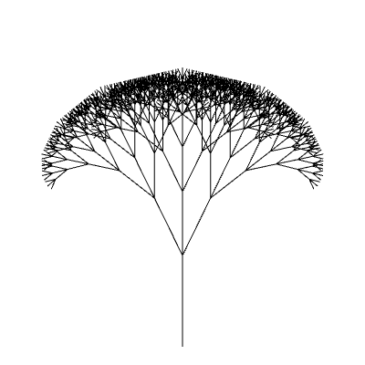
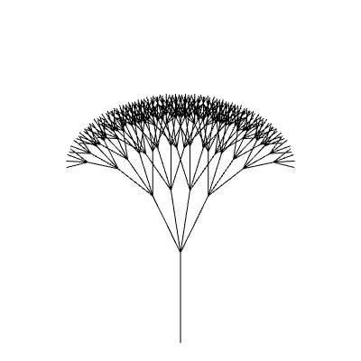
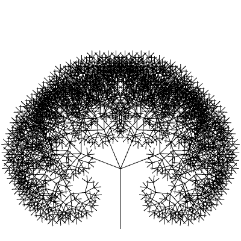

# PythagorasTree
«PythagorasTree» или «Древо Пифагора» — фрактал похожий на дерево.

Версия: 1.0.0 (09.10.2023)

## Скриншоты

## Интерфейс
Рычажок «Угол» управляет углом между ветвями дерева.

Рычажок «Ветви» управляет количеством ветвей, которые растут от одной.

Рычажок «Размером» управляет размером дерева.

Кнопка «Скачать» скачивает изображение холста.

## Изменения
### 1.0.0 (09.10.2023)
Первая версия.