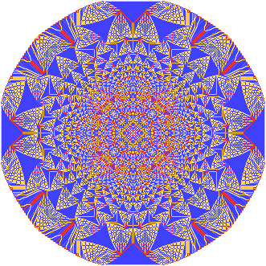

# FractAll

FractAll — сборник фракталов вроде «Множества Мандельброта» или «Песчаной Кучи».

Языки: JavaScript, HTML и CSS.

Версия: 1.0.0 (06.10.2023)

## Скриншоты

## GitHub Pages
Ссылки для просмотра фракталов на GitHub Pages:
- [Множество Мандельброта](https://megospc.github.io/FractAll/Mandelbrot)
- [Песчаная Куча](https://megospc.github.io/FractAll/SandBuch)
- [Кривая Дракона](https://megospc.github.io/FractAll/DragonCurve)