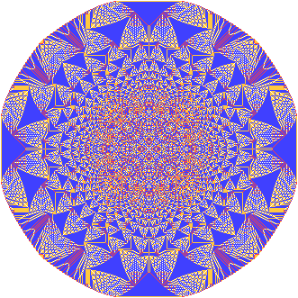

# SandBuch
«SandBuch» или «Куча песка» — клеточный автомат на плоскости из клеток.

Версия: 1.0.0 (06.10.2023)

## Правила
Каждая клетка содержит `n` песчинок. Если `n > 3`, то клетка отнимает `4` от `n`. И прибавляет `1` к `n` клеткок сверху, снизу, слева и справа.

В результате песчаная куча равномерно "расползается" по плоскости.

## Скриншоты
Если в центральную клетку поместить `n` песчинок и дождаться стабильности, то получится фрактальный узор:

## Интерфейс
Рычажок «Скорость» управляет количеством итераций за кадр.

Кнопка «Сбросить» сбрасывает песчаную кучу.

Кнопка «Скачать» скачивает изображение холста.

Кнопка «Запуск/Пауза» запускает или останавливает клеточный автомат.